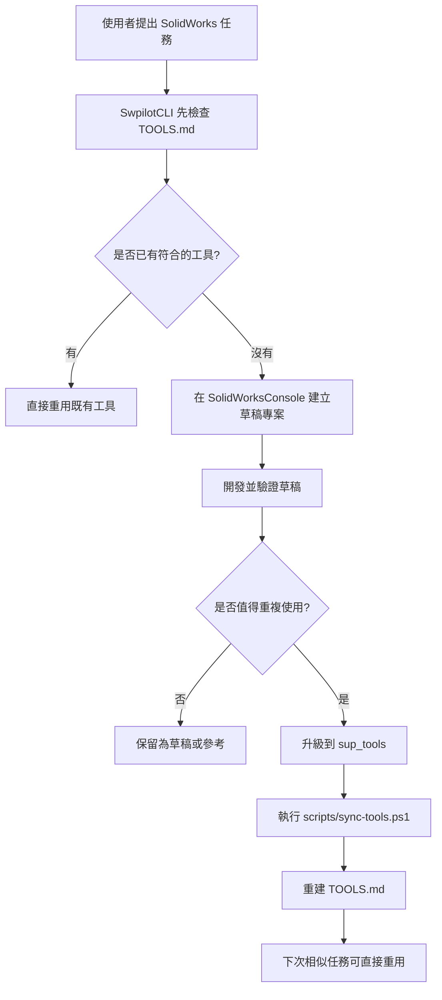

# SwpilotCLI - AI 驅動的全方位 SolidWorks Plugin

<p>
  
  
  
  
  
  
</p>

<p align="center">
  <strong>如果 SwpilotCLI 對你有幫助，歡迎贊助支持開發：</strong>
</p>

<p align="center">
  <a href="https://swapi-pilot.lemonsqueezy.com/checkout/buy/32e55278-7c59-4b11-87cb-44fc66273701">
    
  </a>
</p>

最初將它命名為「Pilot」，是因為我以為它只是用來輔助操作 SolidWorks。

但在專案完成後才發現，它的能力遠不只是輔助，甚至可以「取代你的同事」。

它更像是：

**一位能獨立完成工作的 SolidWorks 工程師。**

SwpilotCLI 的使用流程其實非常簡單，只有三個步驟：

1. 提出你的 SolidWorks 工作需求，SwpilotCLI 會自動建立 Tool。
2. 完成需求後推進到 `sup_tools`，SwpilotCLI 會安裝 Tool。
3. 使用已學會的 Tool，SwpilotCLI 會直接執行。

---

## Demo Videos

### 1. 丟一張手繪圖給 AI，直接生成 SolidWorks 零件

[](https://youtu.be/NmeGahaNNik)

```text
prompt:
你將照片裡的工程圖轉成 SolidWorks 零件圖，
我幫你打開新零件了，你畫在上面就可以，
用邏輯去推算有疑問尺寸，不用再問我直接完成它。
```

### 2. 把自然語言編譯成 SolidWorks Macro

[](https://youtu.be/W1-Z9c_huSo)

```text
prompt:
你寫一個程式，執行後會把 "D:\Del3" 裡面所有 SolidWorks part 的材質都設定成 "6061-T6 (SS)"。
```

### 3. 讓 AI 幫你整理 SolidWorks，螺絲螺母全自動分好

[](https://youtu.be/DzMBnQK84f4)

```text
prompt:
將 "D:\Del4" 資料夾下的 SolidWorks 檔案打開來分類，
螺絲放在 "螺絲" 資料夾，
螺母放在 "螺母" 資料夾，
資料夾給你新增。
```

---

## 安裝

### 前置條件

1. 電腦必須要有 **Claude Code CLI**、**Codex CLI**、**Pi Coding Agent**，或其他可以在 CMD 下執行的 AI model for CLI。
2. 建議關閉沙盒模式，不然執行時容易報錯。
3. 電腦必須要有 SolidWorks。

也就是：

- Claude Code Pro
- Codex Pro
- Pi Coding Agent（開源免費）
- SolidWorks

### 安裝步驟

1. 下載 SwpilotCLI。
2. 將 SwpilotCLI 資料夾放到你想安裝的路徑，建議放在 `C:\SwpilotCLI`。
3. 在 SwpilotCLI 資料夾下執行 CLI，然後輸入：

```text
幫我安裝 SwpilotCLI。
請依照 Install.md 安裝，不要問問題，做合理假設並繼續。
使用最新安裝的 SOLIDWORKS 版本。
建置、複製相依檔案、註冊 add-in、設定 Codex MCP，並驗證結果。
```

4. 等待安裝完成。

### 安裝 Demo Video

[](https://youtu.be/emlcr3aU6Zs)

### 實際安裝和設定的項目

1. SwpilotCLI add-in 本體。
2. 將 SolidWorks 本機相依 DLL 複製到安裝來源。
3. .NET 8 SDK。
4. .NET Framework Developer Pack。
5. MCP 設定：swapi-pilot（支援 Claude Code CLI、Codex CLI 和 Pi Coding Agent）。
6. PowerShell 執行原則。

MCP 設定：

- 名稱：`swapi-pilot`
- URL：`https://swapi-pilot.com/mcp`

---

## 介面說明


這裡要特別強調，SwpilotCLI 之所以能完美控制 SolidWorks，是因為它使用 `swapi-pilot-solidworks-mcp` 這個 MCP 來查詢 SolidWorks API。

本來我設計 `swapi-pilot-solidworks-mcp` 時，以為會有很多人使用，結果發現寫 SolidWorks API 的人真的太少，所以這個 MCP 專案只有少數受眾。

心有不甘，所以我用 `swapi-pilot-solidworks-mcp` 作為底層架構，做了一個受眾大一點的 SwpilotCLI。

但是 Claude CLI 跟 Codex CLI 需要付費訂閱。Pi Coding Agent 對開源專案免費，讓 SwpilotCLI 能服務更廣泛的使用者。

`swapi-pilot-solidworks-mcp` 專案網址：

https://github.com/arthurle3210/swapi-pilot-solidworks-mcp

---

## 建立 Tool 範例：sup_tools Workflow

如果你使用的是 Codex CLI，請確保將審核和權限都設定為 Full Access。

否則，它可能會在沙盒模式下運行，這可能會導致長時間延遲或進程掛起。

[](https://youtu.be/DVSn7tBQjfk)

```text
prompt:
畫一個 40x40x10 的正方體。
正中間打一個 10 mm 的圓孔。
中間的圓自動導角 0.5 C x 45 度。
然後打開 "D:\Del3\part5.SLDPRT"，看到圓孔就導角 0.5 C x 45 度。
看一下 SolidWorksConsole 有哪些可以推到 sup_tools，哪些可以刪除。
照你說的，該刪的刪，該推 sup_tools 就推 sup_tools。

確認下面事項：
TOOLS.md 已經由 sync-tools.ps1 重建。
```

請一定要記得：

## 每次做完一定要叫 SwpilotCLI 幫你推進到 sup_tools

你訓練的 skills 會是最適合你使用的工具，你必須要推到 `sup_tools`。

這樣 SwpilotCLI 才能在你下次使用時，直接去 `sup_tools` 裡面找合適的 tool。

如果沒有推到 `sup_tools`，下次使用時又會重寫一次 code，這不是 SwpilotCLI 的使用方式。

---

## 一般使用者看到這裡就可以開始使用了

下面是給開發者看的，一般使用者可以跳過。

---

## Open Code

SwpilotCLI 所產生的工具皆為 Open Code，程式碼完全可見、可控、可自行擴展。

`SolidWorksConsole`、`sup_tools` 裡面都是 C# code，你也可以直接用 SwpilotCLI 來幫助你寫 code。

---

## 視覺系統

SwpilotCLI 看得到 SolidWorks 的畫面，因此可以協助檢查模型與工程圖。

從寫 code 到確認成果，讓 AI 不只是操作 SolidWorks，而是能真正「看懂並驗證結果」。

---

## 命名規則

- `swpilotcli-xxxx`：通用基本功能。
- `swpilotcli-ActionGroup-xxxx`：客製化工作流功能，通常由複數功能組成。

---

## TOOLS.md

[`TOOLS.md`](TOOLS.md) 裡面寫了可以呼叫的 Tools。

它是由 `scripts/sync-tools.ps1` 生成的，每次把工具推到 `sup_tools` 後都會重新產生一次。

---

## SwpilotCLI Tool 訓練流程深度說明

SwpilotCLI 的核心流程是：先重用現有工具，只有在找不到合適工具時，才到 `SolidWorksConsole` 開發草稿，驗證後再決定是否升級到 `sup_tools`，最後重建 `TOOLS.md`，讓後續相似任務可以直接命中既有工具。

### 流程圖



### 標準流程

1. 使用者提出 SolidWorks 任務。
2. SwpilotCLI 先檢查 `TOOLS.md`。
3. 如果已經有符合的工具，SwpilotCLI 直接重用，不重新開發。
4. 如果沒有符合的工具，SwpilotCLI 就在 `SolidWorksConsole` 建立草稿專案。
5. 草稿會先在該目錄完成開發與驗證。
6. 如果這段能力具有長期重用價值，就升級到 `sup_tools`。
7. 升級完成後，執行 `scripts/sync-tools.ps1` 重建 `TOOLS.md`。
8. 之後遇到相似任務時，SwpilotCLI 就可以先從 `TOOLS.md` 找到並重用這個工具。

### 目錄角色

| 目錄 / 檔案 | 角色 |
| --- | --- |
| `SolidWorksConsole` | 草稿開發與驗證區 |
| `sup_tools` | 正式可重用工具區 |
| `TOOLS.md` | 自動產生的工具索引 |

### 補充說明

- `TOOLS.md` 不應手動編輯。
- `TOOLS.md` 是透過掃描 `main_tools` 與 `sup_tools` 自動重建的。
- 不是每個草稿都需要升級到 `sup_tools`。
- 這個流程的價值在於累積：每多一個正式工具，後續相似任務就能更快完成。

---

## License

請參考 [LICENSE](LICENSE)。

---

[English](README.md)
